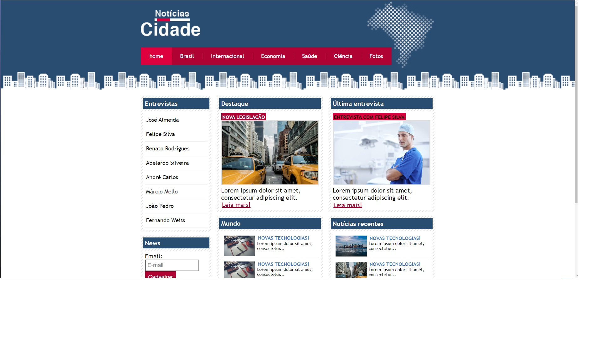

<h1 align="center"> Site Noticias </h1>

Site Criado a partir das aulas ministradas pelo professor Jailton Damasceno!

  <a href="#-tecnologias">Tecnologias</a>&nbsp;&nbsp;&nbsp;|&nbsp;&nbsp;&nbsp;
  <a href="#-projeto">Projeto</a>&nbsp;&nbsp;&nbsp;|&nbsp;&nbsp;&nbsp;
  <a href="#-layout">Layout</a>&nbsp;&nbsp;&nbsp;|&nbsp;&nbsp;&nbsp;
  <a href="#memo-licença">Licença</a>

  

 

  

## 🚀 Tecnologias

Esse projeto foi desenvolvido com as seguintes tecnologias:

- HTML e CSS
- Git e Github

## 💻 Projeto

O Site noticias é um projeto que simula um site de noticias, ministradas pelo professor Jailton Damasceno.
Os conhecimentos adquiridos nesse projeto, como elementos básicos de HTML e CSS, reforçando meu aprendizado para avançar em novas tecnologias.

## 🔖 Layout

O Layout foi criado a partir das aulas ministradas pelo professor Jailton Damasceno.

## :memo: Licença

Esse projeto está sob a licença MIT.

---

Feito com ♥ by Douglas Martins Distributed By DSM Mídia
